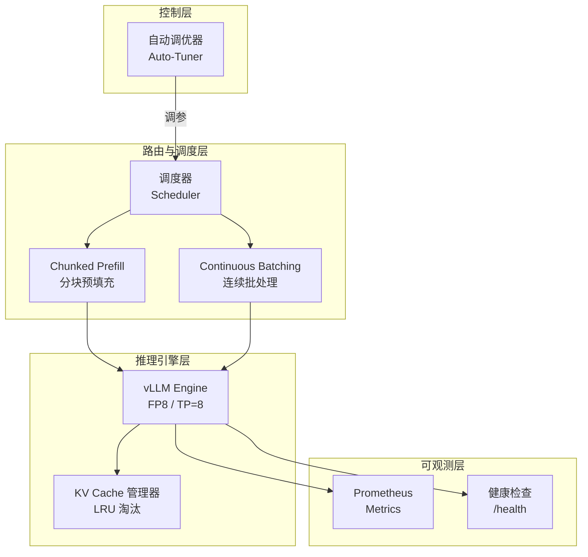
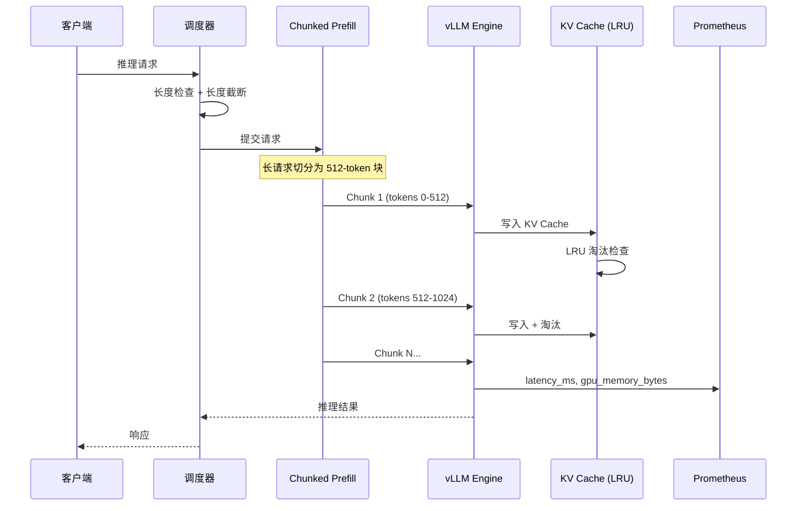
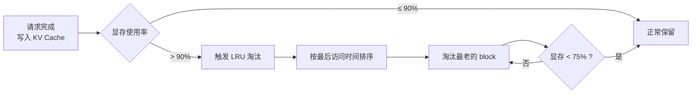
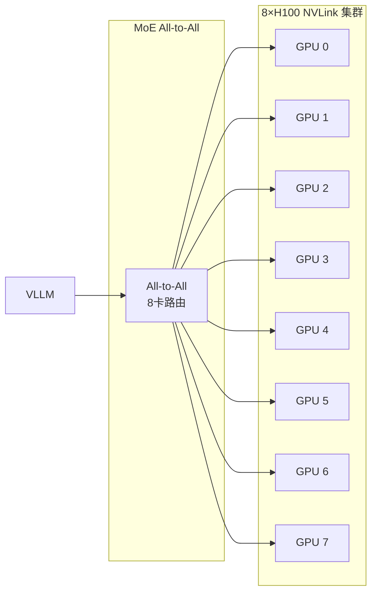

# DeepSeek-V4-Flash 8×H100 推理优化系统

## 技术方案书

> **版本：** v1.0
> **日期：** 2026-07-18
> **状态：** 初稿

---

## 一、课题背景与目标

### 1.1 业务场景

本题面向公司内 **AI Coding 场景下的大模型在线推理系统优化**。目标是在 8×H100 集群上完成 DeepSeek-V4-Flash 的稳定部署与性能优化，并在真实 SWE-bench 工作负载下完成系统级验证。

### 1.2 核心挑战

| 挑战 | 表现 | 根因 |
|------|------|------|
| 长上下文显存压力 | 代码仓库级依赖，KV Cache 快速膨胀 | max_seq_len 大，单请求显存占用高 |
| 延迟抖动 | P99 延迟剧烈波动 | 长短请求混合，长请求阻塞短请求 |
| GPU 利用率低 | 8×H100 算力未充分利用 | Prefill/Decode 互相等待，批处理不充分 |
| 长尾分布 | 请求分布不均，突发性强 | SWE-bench 任务特性 |

### 1.3 优化目标

| 指标 | 基线（假设） | 优化目标 | 提升 |
|------|------------|---------|------|
| P99 延迟 | 10.0 s | < 5.0 s | 50%+ |
| QPS | 50 | > 100 | 100%+ |
| GPU 利用率 | 50% | > 80% | 30pp |
| KV Cache 命中率 | 40% | > 70% | 30pp |
| SWE-bench 完成率 | 95% | > 99% | 4pp |

> ⚠️ 基线为假设值，待实测校准。

---

## 二、系统架构

### 2.1 四层架构总览



### 2.2 请求处理流程



### 2.3 KV Cache LRU 淘汰流程



### 2.4 TP=8 分布式架构



---

## 三、核心优化方案

### 3.1 KV Cache 精细化管理（LRU 淘汰）

**策略：** LRU（Least Recently Used），最近最少使用优先淘汰。

**触发条件（满足任一）：**
- 显存使用率 > 90%（高水位）
- 可用 KV Cache block 数 < 10（低阈值）

**淘汰逻辑：**
```
1. 按 last_access_time 升序排列所有活跃 block
2. 从最老 block 开始淘汰
3. 直到显存 < 75% 或已淘汰 50 个 block
```

**优势：** 简单高效，与 SWE-bench 长尾分布局部性匹配。

### 3.2 Chunked Prefill（分块预填充）

**策略：** 将长输入切分为 512 tokens/块，逐块 prefill，不阻塞 Decode 阶段。

**配置：**
| 参数 | 值 | 说明 |
|------|---|------|
| chunk_size | 512 tokens | 每块 token 数 |
| max_chunks_per_request | 64 | 单请求最大块数 |
| prefill_ratio | 0.3 | prefill 占比上限 |
| max_wait_time_ms | 100 | 凑批超时 |

**反饥饿机制：**
```
调度优先级 = request_remaining_tokens / (1 + wait_time × 0.1)
```

**效果示意：**

```
优化前（长请求阻塞）：
[========== Long Request Prefill ==========][Decode][Decode]  ← 短请求等待 30s+

优化后（Chunked Prefill）：
[==Chunk1==][==Chunk2==][D][D] | [==Chunk3==][D][D][D]  ← 短请求立即Decode
```

### 3.3 Continuous Batching（连续批处理）

**策略：** 迭代级调度，batch 完成后立即插入新请求，不等待下一批凑满。

**不采用 Micro-Batching 的原因：**
- TP=8 + MoE All-to-All 场景下，micro-batch 切换 overhead 大于收益
- MoE 长请求为主，等待 batch 结束的利用率损失可接受

### 3.4 TP=8 张量并行

**策略：** 8×H100 全互联 NVLink，张量并行 TP=8。

**NCCL 调参：**
```bash
NCCL_MIN_NCHANNELS=8
NCCL_MAX_NCHANNELS=16
NCCL_IB_TIMEOUT=20
NCCL_IB_RETRY_CNT=7
```

---

## 四、可观测性设计

### 4.1 指标体系

| 类型 | 指标 | 格式 |
|------|------|------|
| 延迟 | inference_latency_ms, prefill_latency_ms, decode_latency_ms | Histogram |
| 吞吐 | requests_total, tokens_generated_total | Counter |
| 显存 | gpu_memory_used_bytes（按 gpu_id 分 labels） | Gauge |
| 缓存 | kv_cache_hit_rate | Gauge |
| 队列 | queue_length, active_requests | Gauge |
| 事件 | kv_cache_evicted_total, oom_events_total | Counter |

**暴露方式：** `/metrics` 端点，Prometheus 抓取。

### 4.2 健康检查

- `/health` 端点（vLLM 内置）
- 单请求 30s 超时强制 kill

---

## 五、容错与自愈

| 保护机制 | 实现方式 |
|---------|---------|
| 防 OOM | KV Cache LRU 淘汰 + 单请求显存预算限制 |
| 防延迟抖动 | Chunked Prefill + prefill_ratio=0.3 |
| 超时保护 | 单请求 30s 强制 kill |
| 健康检查 | `/health` 端点 |
| 自动重启 | 容器基础设施负责（Docker/k8s） |

---

## 六、交付物清单

| # | 交付物 | 说明 |
|---|--------|------|
| 1 | `Dockerfile` | CUDA 12.x + PyTorch + vLLM，一键构建 |
| 2 | `launch_h100.sh` | 一键启动，支持 --model / --tensor-parallel-size 等参数 |
| 3 | `src/kv_cache_manager.py` | LRU KV Cache 管理 |
| 4 | `src/scheduler.py` | Chunked Prefill + Continuous Batching |
| 5 | `src/inference_engine.py` | vLLM 引擎封装 |
| 6 | `src/metrics_exporter.py` | Prometheus 指标暴露 |
| 7 | `src/control/auto_tuner.py` | 自动调优（参赛亮点） |
| 8 | `tests/benchmark_*.py` | SWE-bench 评测脚本 |
| 9 | `docs/REPRODUCTION.md` | 基线 vs 优化对比文档 |
| 10 | `README.md` | 项目说明 |

**一键启动命令：**
```bash
bash launch_h100.sh \
  --model deepseek-v4-flash \
  --tensor-parallel-size 8 \
  --gpu-memory-utilization 0.90
```

---

## 七、接口契约

### 7.1 控制层 ↔ 调度层（gRPC）

```protobuf
service SchedulerControl {
  rpc UpdateConfig(UpdateConfigRequest) returns (UpdateConfigResponse);
  rpc GetStatus(GetStatusRequest) returns (GetStatusResponse);
}

message UpdateConfigRequest {
  int32 batch_size = 1;
  int32 chunk_size = 2;
  float kv_cache_high_watermark = 3;
}
```

### 7.2 调度层 ↔ 推理引擎层（进程内 Python）

```python
class SchedulerEngineAPI:
    def submit(self, request: InferenceRequest) -> str: ...
    def get_result(self, request_id: str) -> InferenceResponse: ...
    def cancel(self, request_id: str) -> bool: ...
    def get_queue_status(self) -> QueueStatus: ...
```

---

## 八、关键配置参数汇总

| 参数 | 值 | 文件 |
|------|---|------|
| KV Cache 淘汰策略 | LRU | `configs/kv_cache.yaml` |
| chunk_size | 512 tokens | `configs/chunked_prefill.yaml` |
| prefill_ratio | 0.3 | `configs/batching.yaml` |
| max_batch_size | 32 | `configs/batching.yaml` |
| max_wait_time_ms | 100 | `configs/batching.yaml` |
| TP size | 8 | `configs/model.yaml` |
| 量化精度 | FP8 | `configs/model.yaml` |
| 单请求超时 | 30s | `configs/scheduler.yaml` |
