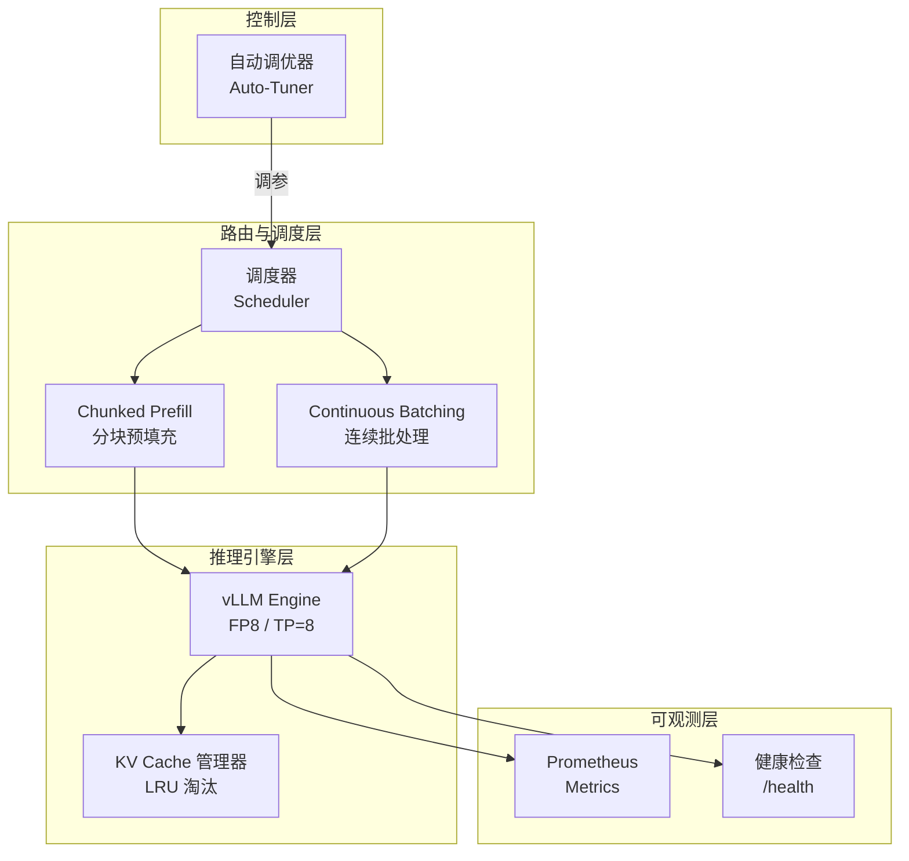
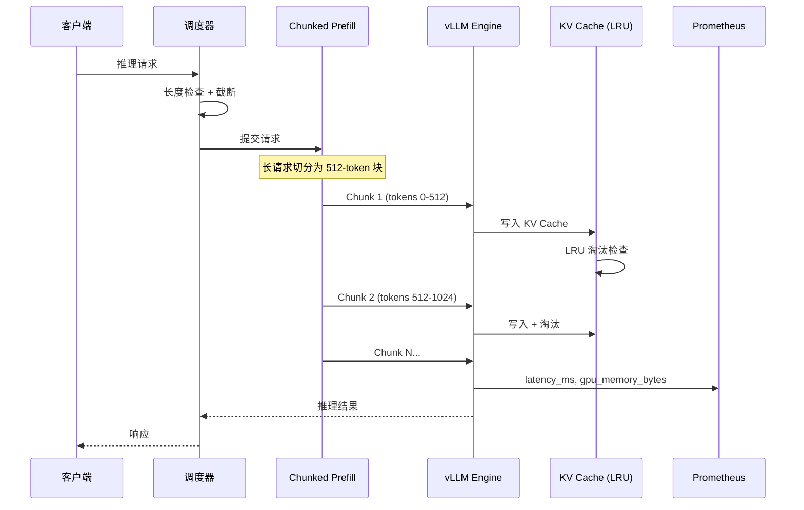
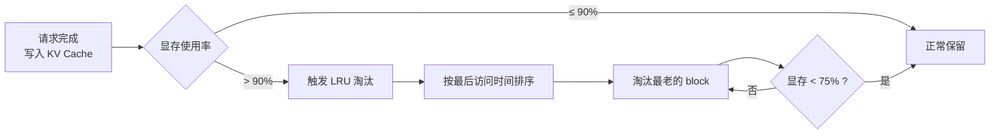
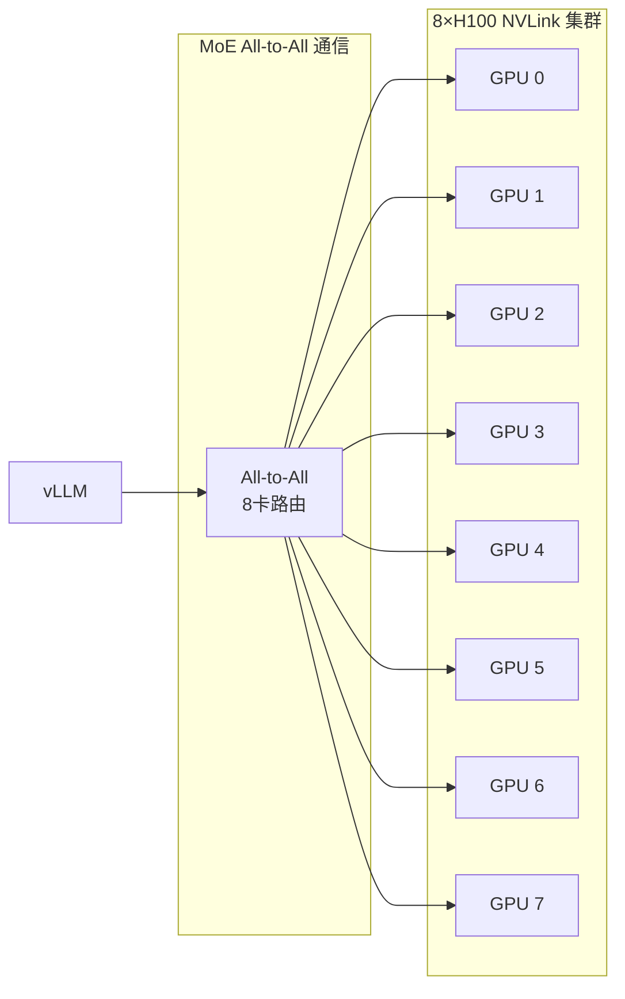
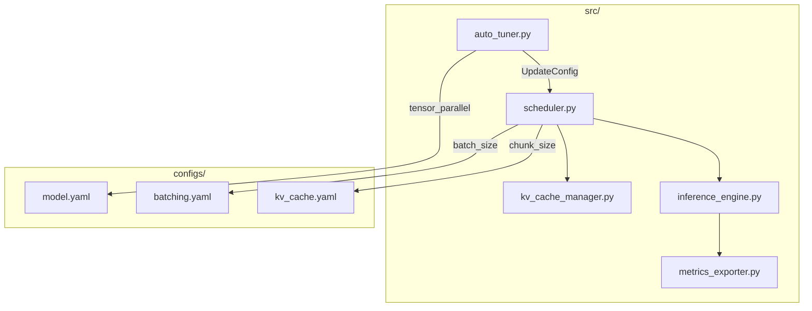

# 架构图集

> 本文件包含系统架构的 Mermaid 源码，可直接在 GitHub/GitLab/Docusaurus 中渲染。

---

## 图 1：四层架构总览



---

## 图 2：请求处理时序



---

## 图 3：LRU 淘汰流程



---

## 图 4：TP=8 分布式架构



---

## 图 5：Continuous Batching 调度

```mermaid
gantt
    title Continuous Batching 调度示意
    dateFormat X
    axisFormat %s s

    section Batch 1
    ReqA :0, 15
    ReqB :0, 15
    ReqC :0, 15
    ReqD :0, 15

    section Batch 2
    ReqE :16, 28
    ReqF :16, 28
    ReqG :16, 28
    ReqH :16, 28
```



---

## 图 6：优化前后延迟对比

```mermaid
xychart-beta
    title "P99 延迟对比（假设）"
    x-axis [基线, 优化后]
    y-axis "延迟 (s)" 0 --> 12
    bar [10, 4.5]
    line [10, 4.5]
```

> ⚠️ 基线为假设值，待实测后更新。

---

## 图 7：模块依赖关系


